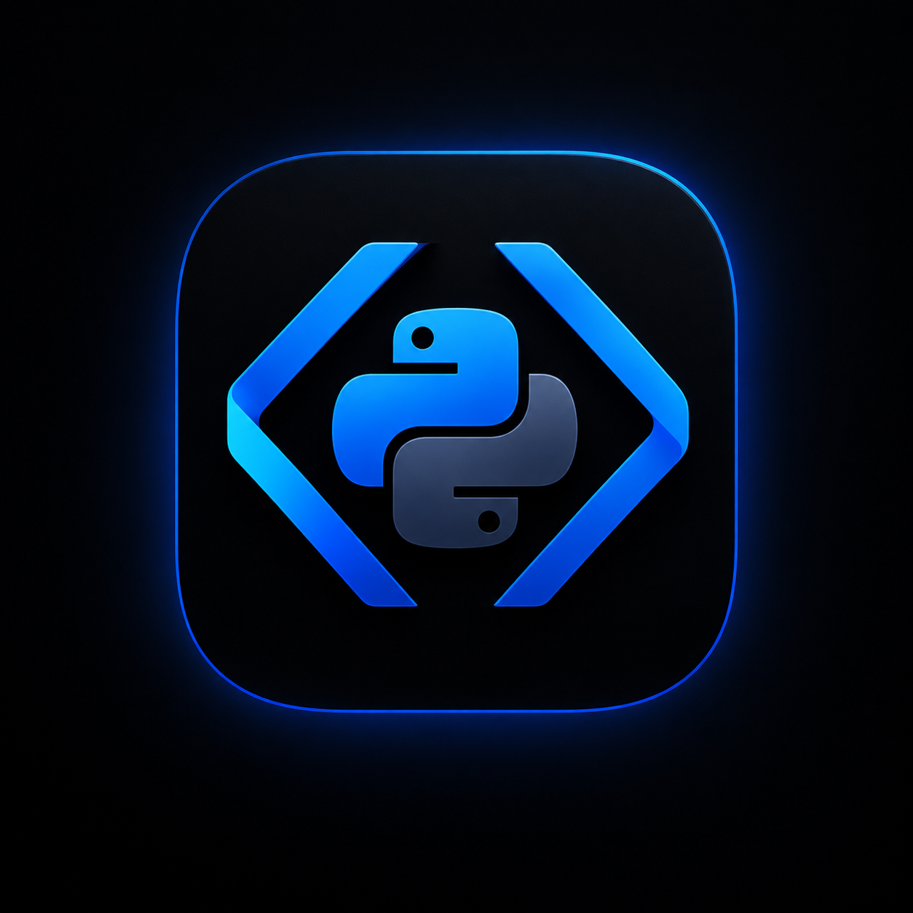

<p align="center">
  
</p>

# PyPilot for Zed

When you clone a Python repository and run an install, it often fails because a dependency lacks a prebuilt wheel for your interpreter. PyPilot calculates which Python versions the project's dependencies actually support, configures a virtual environment on that version, and identifies the specific package causing any constraint conflict.

Every resolution relies on PyPI package metadata and local lookup tables. The tool runs locally without API keys or external services.

## The problem it solves

A package's `requires_python` field is often incomplete. For example, mediapipe 0.10.9 declares `>=3.8`, yet only ships wheels for cp39 through cp312. If you try installing it on Python 3.13, pip searches for an unavailable source distribution and terminates with a metadata error that never mentions Python version incompatibility.

PyPilot checks both signals. It takes `requires_python` as an initial range, then intersects that range with the interpreter versions that provide prebuilt wheels for your operating system and CPU architecture. After evaluating each dependency in the workspace, the resulting intersection represents the interpreters that can run the entire project. When this intersection is empty, PyPilot names the conflicting packages and shows their incompatible requirements.

Naming the two conflicting packages matters more than applying an automated workaround, because a dependency collision is where package manager error output is least helpful.

## What else it catches

### Outdated or removed APIs
Package metadata verifies whether a package installs, but cannot verify whether your code runs against that release. For example, mediapipe 0.10.35 installs cleanly on modern CPython releases and then crashes on `module 'mediapipe' has no attribute 'solutions'` because Google removed the legacy API. PyPilot inspects the installed package on disk, flagging references like `mp.solutions` in your editor while you write code instead of waiting for runtime failures.

### GPU driver and CUDA alignment
For pip-installed frameworks, the host NVIDIA display driver determines compatibility rather than the system CUDA toolkit. Wheels package their own CUDA runtime, and display drivers remain backward compatible. PyPilot inspects `nvidia-smi`, maps the driver to its highest supported CUDA runtime, and selects the matching PyTorch index (such as `cu124` instead of a mismatched default). Systems without a dedicated GPU use CPU wheels, while Apple Silicon devices receive MPS guidance.

### Pinned version constraints
Pinned dependencies restrict the wheel search space. A declaration like `mediapipe==0.10.14` is evaluated against wheels published for that specific release (which ended at Python 3.12), rather than the wider matrix of newer releases.

## Environment management with uv and pip

PyPilot supports both `uv` and standard `pip` for managing virtual environments.

### Project initialization and uv mode
When `package_manager = "uv"` (the default):
- If the project directory lacks a `pyproject.toml`, PyPilot runs `uv init` to create one.
- If a `requirements.txt` file exists during setup, PyPilot reads its dependencies and runs `uv add` to migrate them directly into the new `pyproject.toml`.
- Running `pypilot install <package>` invokes `uv add <package>`, adding the dependency to the project manifest and syncing the environment.

### Pip fallback and freeze synchronization
When `uv` is unavailable on the system or `package_manager = "pip"` is explicitly configured:
- PyPilot creates the virtual environment using Python's standard `venv` module.
- Dependencies are installed using `pip install`.
- After each installation or dependency modification, PyPilot runs `pip freeze > requirements.txt` to update the file with pinned versions. This keeps your dependencies documented and reproducible even without a lockfile manager.

## Installation

Install PyPilot from Zed's extension panel. When you open a Python folder, the extension automatically inspects the environment and opens a notification if action is required.

### Local development build
To test the extension locally:
1. Build and install the helper binary with `cargo install --path helper`.
2. In Zed, open the command palette and run `zed: install dev extension`, selecting the `extension` directory.

The extension checks PATH first, running your local binary instead of fetching a release from GitHub.

## Architecture

PyPilot splits work between two components:
- A WebAssembly shim in `extension/` that runs inside Zed. It identifies the host platform, downloads the precompiled helper binary for that architecture, and registers it with Zed as an LSP server.
- A native Rust binary in `helper/` that runs all analysis, environment orchestration, dependency parsing, and LSP communication.

Because the editor extension contains no business logic, changes in Zed extension APIs do not affect environment resolution or compatibility checking.

## Repository layout

```
pypilot/
├── extension/           Zed WebAssembly shim (extension.toml and src/lib.rs)
├── helper/              Native helper binary
│   ├── src/
│   │   ├── main.rs      CLI command dispatch
│   │   ├── cli/         Subcommand entry points
│   │   ├── lsp/         Language server protocol implementation
│   │   ├── core/        Virtual environment management, uv and pip drivers, solver
│   │   ├── pypi/        Package metadata parser and local cache
│   │   └── matrix/      Driver and framework compatibility tables
│   ├── data/            Bundled JSON tables for NVIDIA and frameworks
│   └── tests/           Fixtures and offline test suites
├── tasks/               Zed task templates
└── .github/workflows/   CI and release automation workflows
```

## Commands

Zed extensions execute external actions through tasks. To use PyPilot commands inside Zed, copy `tasks/pypilot.json` into `.zed/tasks.json` within your workspace or into your global Zed tasks configuration. You can then trigger them using `task: spawn`.

The helper binary also runs directly in any shell:

```
pypilot doctor            Inspect the environment and print a status report
pypilot setup             Configure the virtual environment and install dependencies
pypilot check <package>   Check whether a package runs on the current Python version
pypilot install <pkg>     Install a package and update the project manifest
pypilot fix python        Rebuild the virtual environment on a compatible Python version
pypilot fix cuda          Re-pin torch and tensorflow to the system driver build
pypilot update-data       Update the bundled driver and framework data tables
pypilot migrate-conda     Convert environment.yml into pyproject.toml
pypilot lsp               Start the language server (launched automatically by Zed)
```

Running `pypilot doctor` or `pypilot setup` from a Zed task also writes a request file to the cache directory. The running language server reads this file and presents the results as interactive editor notifications.

## Configuration

PyPilot stores default configuration in your platform config directory. Projects can override these options by creating a `.zed/pypilot.toml` or `pypilot.toml` file in the workspace root:

```toml
package_manager    = "uv"             # "uv" or "pip". Pip mode does not invoke uv.
notifications      = "problems-only"  # "all", "problems-only", or "off"
auto_check_on_open = true
data_refresh_days  = 7                # Set to 0 to disable network updates.
```

- `package_manager`: Selects whether to manage packages using `uv` or `pip`. In pip mode, PyPilot cannot download new Python interpreter versions automatically; if an incompatible version is detected, it informs you which Python version to install manually.
- `notifications`: Controls alert frequency. `problems-only` warns about errors and version mismatches. `all` includes informational alerts like selected CUDA builds. `off` suppresses editor notifications. Diagnostics and code actions in active editor buffers remain enabled unless set to `off`.
- `data_refresh_days`: The refresh interval for the bundled driver and framework matrices. PyPilot ships with embedded JSON tables for offline use. If a background check fails, it falls back to the embedded data.

## Building from source

```bash
cargo test  -p pypilot-helper
cargo build -p pypilot-helper --release

rustup target add wasm32-wasip2
cargo build -p pypilot-zed --target wasm32-wasip2 --release
```

Tests run offline against recorded PyPI fixtures and fixed Linux x86-64 target tags.

## License

PyPilot uses two licenses corresponding to its components:
- `helper/` is licensed under AGPL-3.0-or-later. See [helper/LICENSE](helper/LICENSE).
- `extension/` is licensed under Apache-2.0. See [LICENSE](LICENSE). This complies with the Zed extension registry requirements for extension frontends.
